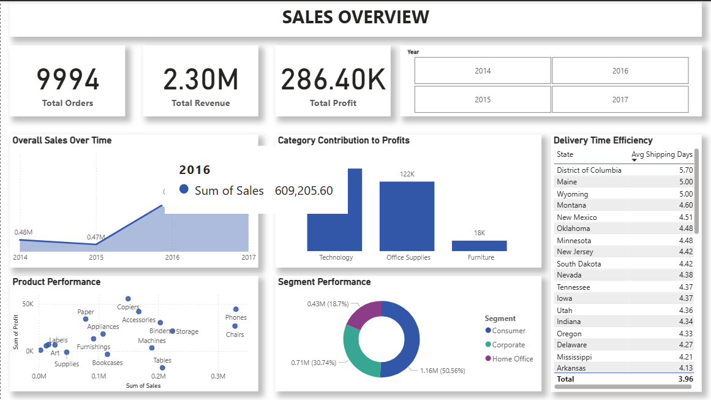
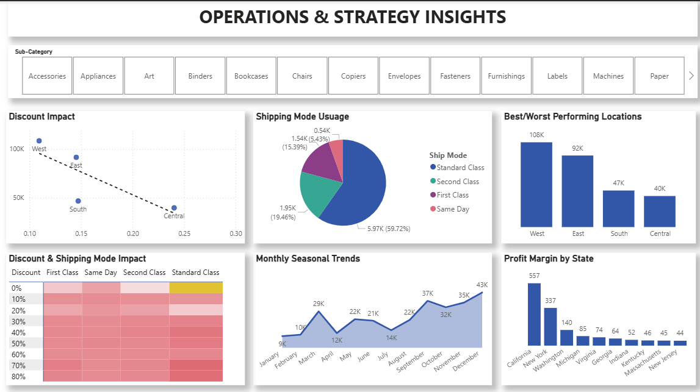

# Introduction

The Superstore dataset is a sales dataset from a US-based retail company, widely used for business analytics and data visualization projects. It contains a couple of records of customer orders, including information on sales, profit, product categories, shipping methods, customer segments, and regional performance. This dataset is ideal for exploring business trends, identifying profitable segments, and uncovering operational inefficiencies through exploratory data analysis (EDA).

# Background

This dataset has over 9,000 records and 21 columns, making it a rich source for generating business insights. It covers various aspects of operations, from order details and shipping logistics to customer demographics and sales performance across different states and categories. With its diverse and comprehensive nature, the dataset is a valuable resource for analysis and visualization using tools like Excel and Power BI.

# Tools I Used

To explore this dataset, I made use of 

- Power Query Editor: to transform ETL (extract, transform, and load) before inserting the dataset into Power BI.
- Power BI: a high-end data visualization tool for viewing and constructing information from the data.
- Git & Github: for tracking and sharing my projects.

# Data Cleaning Process

Cleaning the dataset was a crucial step to ensure that the analysis is based on high-quality, error-free data. The following data cleaning procedures were applied:

**Assigning Proper Data Type:** Made sure each column has the correct datatype so as not to have problems visualizing it, e.g., the date columns.

**Creating New Columns:** To enhance the dataset and allow for more in-depth analysis, several new columns were derived from the original data using DAX functions.

- Profit Margin
- Shipping Days
- and created a list for grouping discounts.

# The Analysis

Made use of ChatGPT to generate a couple business questions that needs answering:

### Sales & Profit Performance
1. What are the overall sales, profit, and quantity sold over time?
2. Which product categories and sub-categories contribute most to sales and profit?
3. Which products are underperforming (high sales but low profit or losses)?

### Customer Behavior
4. Which customer segments (Consumer, Corporate, Home Office) generate the most profit and sales?
5. Which regions and states have the highest and lowest performance?
Temporal Trends
6. How do sales and profit vary by month, quarter, or year?

### Shipping and Discounts
8. How do discounts impact profit and sales?
9. Which shipping modes are most used and profitable?

### Geographical Performance
10. Which regions or cities should the business focus on or reconsider?
11. Are there states with negative profit margins that need attention?

### Operational Efficiency
12. What’s the average delivery time from order to ship date?
13. Is there a relationship between shipping mode, discount, and profit?

# Exploratory Data Analysis

### Summary Analysis

The exploratory data analysis of this dataset, uncovered several key business insights across sales performance, customer segmentation, product profitability, and operational efficiency. The sales overview dashboard revealed a total of 9,994 orders generating approximately $2.3 million in revenue and $286,400 in profit. Sales showed a positive upward trend from 2014 to 2017, with 2017 recording the highest performance. Among the product categories, Technology led in profit contribution, while Furniture lagged. The Consumer segment was the largest revenue generator, contributing over half of total sales. Delivery time analysis showed an average shipping duration of 3.96 days, with the District of Columbia having the longest average. On the second dashboard, deeper operational insights were uncovered. The Western region dominated in sales, while the Central region consistently underperformed. Although discounts were widely used, they did not always drive sales or profits, especially in the Central region. Standard Class emerged as the most frequently used shipping mode, likely due to cost efficiency. Seasonal trends highlighted strong sales in November and December, reflecting holiday-driven purchases. Lastly, state-level analysis revealed that California and New York were the most profitable, whereas several other states had minimal or negative profit margins. These findings provide a comprehensive view of business performance and can guide future strategic decisions.

### Dashboard

# Recommendations

- Re-evaluate discount strategies, particularly in low-performing regions like the Central region.
- Improve marketing efforts and product mix in underperforming categories like Furniture.
- Consider optimizing shipping strategies for faster delivery in lagging states (e.g., District of Columbia).
- Target high-performing customer segments (e.g., Consumer) with personalized offers to drive loyalty.
- Allocate more resources and promotions to peak months (November–December) to maximize seasonal sales.
- Analyze underperforming states further to determine if operations should be improved or scaled down.
